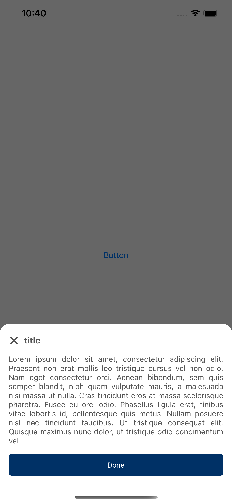

# RKDialogbox

  <table>
    <tr>
      <td></td>
      <td></td>
    </tr>
  </table>
  
## Installation

RKDialogbox is available through [CocoaPods](https://cocoapods.org). To install
it, simply add the following line to your Podfile:

```ruby
pod 'RKDialogbox'
```

## Usage

First, your should import framework to swift file:

```swift
import RKDialogbox
```
Then use it wherever you need to display the Dialog 😌

example for one buttom mood:
```swift
RKDialogbox.oneButton(title: "title",
                      message: "write message here ...",
                      firstButtonTitle: "Done",
                      firstActionCallback: ...,
                      isDismissible: true)
```
and two buttom mood:

```swift
RKDialogbox.twoButton(title: "Title",
                      message: "write message here ...",
                      firstButtonTitle: "OK",
                      secondButtonTitle: "Cancel",
                      isDismissible: true,
                      firstActionCallback: ...,
                      secondActionCallback: ...)
```

⚠️ All parameters in the methods are optional.


## Author

Ramazan Karami (ramazan.karami@gmail.com)

## License

RKDialogbox is available under the MIT license. See the LICENSE file for more info.
